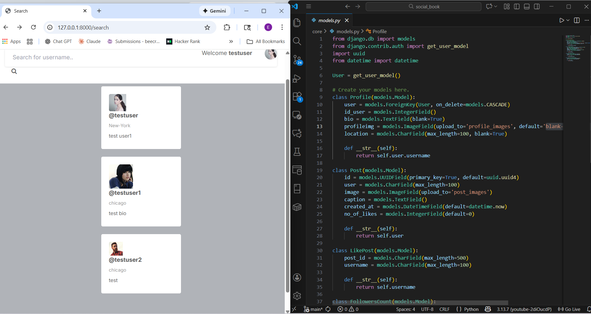

### About the project:
Social Book is simple clone of instagram, where users can sign up, sign in
write some details on profile and upload pictures to gallery.

### Main features:
- Every user can sign in and sign up
- upload pictures and write details
- can view other users
- in main pages list of users will be generated randomly
- can search others users by their username

### what I learned:
- This project was built on Django Web Framework and Python
- followed tutorial and practiced with hands on training
- understand how to set up project environment on Django Web Framework
- with the help of AI tools debugged and unserstand python concepts
- practiced Django Admin Control Panel
- Practiced Model View Template (MVT) pattern of  building application

### Link to sources:
[Youtube tutorial](https://www.youtube.com/watch?v=xSUm6iMtREA&list=LL&index=9)
[My Github Code](https://github.com/DrErkinbek/social_book)